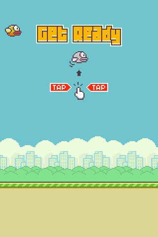

# 🐦 Flappy Bird JS

<div align="center">
  
  
  
  
</div>

<br>

> 🎯 **Clone do Flappy Bird em JavaScript puro com Canvas**, sem bibliotecas e sem etapa de build.

Fiz em 2020 para estudar Canvas, acompanhando o tutorial do [Dev Soltinho](https://youtu.be/jOAU81jdi-c). Em 2026 voltei ao projeto, corrigi os bugs que tinham ficado e completei o jogo com pontuação, tela de Game Over, medalhas e suporte a celular.

<p align="center">
  
</p>

## 📋 Índice

- [🎮 Como jogar](#-como-jogar)
- [✨ Recursos](#-recursos)
- [🧩 Como o código funciona](#-como-o-código-funciona)
- [🎓 O que aprendi em 2020](#-o-que-aprendi-em-2020)
- [🔄 Revisitando o projeto em 2026](#-revisitando-o-projeto-em-2026)
- [📄 Licença](#-licença)

## 🎮 Como jogar

O jogo não tem dependências nem build, mas usa módulos ES. O navegador não carrega módulos abrindo o `index.html` direto do disco, então é preciso servir a pasta por HTTP. Com Python, na raiz do projeto:

```bash
python -m http.server 8000
```

Depois abra `http://localhost:8000`. A extensão Live Server do VS Code também serve.

Clique, toque na tela ou use Espaço, seta para cima ou W. O mesmo comando começa a partida, faz o pássaro pular e sai da tela de Game Over.

## ✨ Recursos

- Pontuação durante a partida, com som a cada cano
- Tela de Game Over com placar, melhor pontuação e medalha
- Medalhas de bronze (5 pontos), prata (10), ouro (15) e platina (20)
- Melhor pontuação salva no navegador
- Sons de pulo, ponto, batida e queda
- Controle por mouse, toque e teclado
- Tela ajustada ao tamanho do celular
- Mesma velocidade em qualquer monitor (60 Hz, 144 Hz etc.)

## 🧩 Como o código funciona

```
src/
├── main.js        ponto de entrada: carrega o sprite sheet e inicia o jogo
├── game.js        estado da partida e troca de telas
├── screens.js     telas Get Ready, partida e Game Over
├── loop.js        loop com passo fixo
├── input.js       mouse, toque e teclado
├── renderer.js    desenho no canvas (sprites e texto)
├── ui.js          placar, Get Ready e quadro de Game Over
├── config.js      números de jogabilidade: gravidade, velocidade, medalhas...
├── sprites.js     coordenadas de cada imagem no sprites.png
├── sounds.js      sons
├── storage.js     melhor pontuação no localStorage
└── entities/
    ├── bird.js
    ├── pipes.js
    ├── ground.js
    └── background.js
```

- **Game.** Guarda a partida (pássaro, canos, chão e placar) e a tela ativa. `update()`, `draw()` e `handleInput()` são repassados para essa tela.
- **Telas.** `InitialScreen`, `PlayingScreen` e `GameOverScreen` formam uma máquina de estados. A troca passa pelo `Game` (`startRound()`, `showGameOver()`, `showInitial()`), então uma tela não precisa conhecer a outra.
- **Entidades.** `Bird`, `Pipes` e `Ground` sabem só se mover e se desenhar. O que acontece numa batida ou num ponto é regra da `PlayingScreen`.
- **Desenho.** Todas as imagens vêm de um único `sprites.png`. O `Renderer` recorta cada imagem pelas coordenadas de `sprites.js` e desenha no canvas.
- **Loop.** O `update()` da tela ativa roda 60 vezes por segundo. O `draw()` roda a cada quadro do monitor.

## 🎓 O que aprendi em 2020

Canvas foi a parte nova. Desenhar, animar e detectar colisão entre os objetos desenhados foi o desafio do projeto.

O Dev Soltinho quase sempre explica o que vai fazer antes de escrever o código. Aproveitei isso: pausava o vídeo e tentava implementar sozinho antes de ver a solução. Em muitos momentos cheguei na lógica por conta própria, e foi o que mais me fez evoluir.

Também ficou claro quanta matemática um jogo simples exige. Gravidade, velocidade, intervalo entre canos e colisão são contas refeitas a cada quadro.

## 🔄 Revisitando o projeto em 2026

Seis anos depois, analisei o código de novo. Encontrei bugs que não tinha percebido na época e recursos que já estavam no sprite sheet e na pasta de áudio, mas nunca tinham sido usados.

### 🐛 Bugs corrigidos

| Bug | Causa | Correção |
|---|---|---|
| Chão andava no dobro da velocidade dos canos | `ground.update()` era chamado no `update()` e de novo no `draw()` da tela | A chamada saiu do `draw()` |
| Morte processada várias vezes | Com o pássaro parado no chão, a colisão disparava a cada quadro: cerca de 30 sons e 30 `setTimeout`. Um timeout atrasado podia devolver o jogador à tela inicial no meio da partida seguinte | Trava `hasCrashed` na tela de partida: a batida é tratada uma única vez |
| Partida nova começava com os canos da anterior | Os canos só eram limpos na morte por cano, não na morte pelo chão | `Game.resetRound()` recria pássaro, canos e placar num único lugar |
| Colisão depois de já ter passado pelo cano | O teste só olhava a borda da frente do cano | O teste olha também a borda de trás |
| Jogo 2,4x mais rápido em monitor de 144 Hz | A física andava um passo a cada `requestAnimationFrame`, que acompanha a taxa do monitor | Loop com passo fixo (ver decisões abaixo) |
| Som do pulo sumia em cliques rápidos | O mesmo `Audio` era reaproveitado, e `play()` não reinicia um som que ainda está tocando | `playSound()` volta o `currentTime` para 0 antes de tocar |
| Canos apareciam por cima do chão | A tela desenhava os canos depois do chão | Ordem de desenho: fundo, canos, chão e pássaro |
| Um cano ficava parado por um quadro | `shift()` dentro do `forEach` altera o array durante a iteração e pula um item | Remoção com `filter()` depois do laço |

### 🧠 Decisões técnicas

**Passo fixo em vez de delta time**

O jeito mais comum de desacoplar a velocidade do monitor é multiplicar cada movimento pelo tempo decorrido (delta time). Preferi um passo fixo: o loop acumula o tempo real e roda `update()` 60 vezes por segundo, enquanto `draw()` segue a taxa do monitor.

- Gravidade `0.3`, pulo `-5` e um cano a cada 100 quadros foram calibrados por quadro. Com passo fixo, esses valores continuam valendo sem ajuste.
- A física fica determinística: o mesmo pulo tem sempre a mesma altura, o que não acontece com delta time variável.
- O número de passos é arredondado (`Math.round`). Sem isso, pequenas variações de tempo num monitor de 60 Hz alternariam 0 e 2 atualizações por quadro, e o movimento engasgaria.
- O tempo acumulado é limitado a 250 ms, para o jogo não tentar recuperar vários segundos de uma vez ao voltar de outra aba.
- O contador de quadros, que controla a animação das asas e o surgimento dos canos, saiu do desenho do pássaro e passou a avançar na lógica (`Game.advanceFrame()`). Se ficasse no desenho, os canos surgiriam mais rápido em monitores de alta taxa.

**Colisão e morte**

- A colisão termina 8 px (4 quadros) antes da cauda do pássaro sair do cano. É uma folga de jogabilidade para não punir quem já passou.
- Na batida, a cena congela por 500 ms antes do Game Over e os cliques são ignorados nesse intervalo.
- `fall.wav` toca 300 ms depois de `hit.wav`, quando o som da batida já está terminando.

**Pontuação, Game Over e medalhas**

- O ponto conta quando o cano passa inteiro pelo pássaro. Cada par de canos guarda `passed` para não contar duas vezes.
- O quadro de Game Over, o botão START e as quatro medalhas já existiam no sprite sheet. As coordenadas foram medidas no próprio `sprites.png`.
- As medalhas ficam numa lista ordenada da maior para a menor, e `find()` pega a primeira que a pontuação alcança. As faixas são metade das do jogo original, para ficarem alcançáveis.
- O sprite sheet não tem números, então o placar usa `fillText` com contorno (`strokeText`) para ficar legível sobre qualquer fundo.
- A melhor pontuação fica no `localStorage`, dentro de `try/catch`. Em modo privado ou com armazenamento bloqueado, o jogo continua funcionando e mostra 0.

**Controles**

- `pointerdown` no lugar de `click`: um único evento para mouse, toque e caneta, que dispara quando o dedo toca a tela, e não quando sai. O botão direito do mouse é ignorado.
- Teclado lido por `event.code`, que identifica a tecla física e não depende do layout do teclado. Segurar a tecla não repete o pulo (`event.repeat`), e `preventDefault()` impede que Espaço e seta rolem a página.

**Celular**

- `@media (pointer: coarse)` detecta quando o toque é a entrada principal. Usei isso em vez da largura da tela para não alterar o jogo numa janela pequena de computador, onde o canvas continua 320x480.
- `width: min(100vw, 100dvh * 2 / 3)` ocupa o máximo da tela mantendo a proporção 2:3. `dvh` desconta as barras do navegador do celular, e `vh` fica declarado antes para navegadores que não conhecem `dvh`.
- `image-rendering: pixelated` mantém o pixel art nítido ao ampliar.
- `touch-action: none` evita zoom e rolagem ao tocar na tela.

**Organização do código**

- **Módulos ES em `src/`.** O antigo `game.js` tinha cerca de 500 linhas com tudo junto. Agora cada arquivo tem uma responsabilidade. O custo é precisar de servidor local para rodar.
- **Classes para o que tem estado, funções para o que só desenha.** `Game`, `Bird`, `Pipes`, `Ground` e as telas guardam estado e viraram classes. Fundo, placar e quadro de Game Over não guardam nada, então são funções.
- **Sem estado global.** Antes, todo objeto lia e alterava um objeto `global`, inclusive dentro dos próprios métodos. Agora cada classe usa `this` e recebe o que precisa por parâmetro, como o `renderer` no `draw()`.
- **Um único ponto de acesso ao canvas.** `Renderer.drawSprite(sprite, x, y)` substituiu 11 chamadas de `drawImage` com 9 argumentos, e as coordenadas de todas as imagens ficam numa tabela só.
- **Números com nome.** Valores de jogabilidade (gravidade, intervalo entre canos, tamanho do vão, tempos da batida, faixas de medalha) ficam em `config.js`. Posições que dependem do desenho, como o lugar da medalha no quadro, ficam junto do código que desenha.
- **Uma responsabilidade por função.** A antiga `pipe.update()` criava, movia, testava colisão, pontuava e tocava som. Agora `Pipes` cria, move e responde perguntas (`collidesWith()`, `markPassedBy()`), e a regra da partida fica na `PlayingScreen`. O pássaro também deixou de chamar o Game Over.
- **Lógica independente do desenho.** O vão entre os canos era calculado no `draw()` e usado na colisão. Agora é calculado quando o cano nasce.
- **Carregamento antes do loop.** O jogo só começa depois que o `sprites.png` termina de carregar.
- **Sons que falham em silêncio.** `play()` devolve uma Promise que é rejeitada quando o navegador bloqueia áudio. O `.catch()` evita erro no console, e o jogo segue sem som.
- **Mesmo resultado, pixel a pixel.** Para garantir que a refatoração não mudou o jogo, gravei a mesma partida antes e depois, com aleatoriedade fixa e jogadas automáticas. Os 920 quadros ficaram idênticos.

## 📄 Licença

[MIT](LICENSE)

---

<div align="center">
  <p>Desenvolvido por <strong>Luiz Matos</strong></p>
  <p>
    <a href="https://github.com/luiz-matos">GitHub</a> •
    <a href="https://www.linkedin.com/in/luizeduardomatos/">LinkedIn</a>
  </p>
</div>
